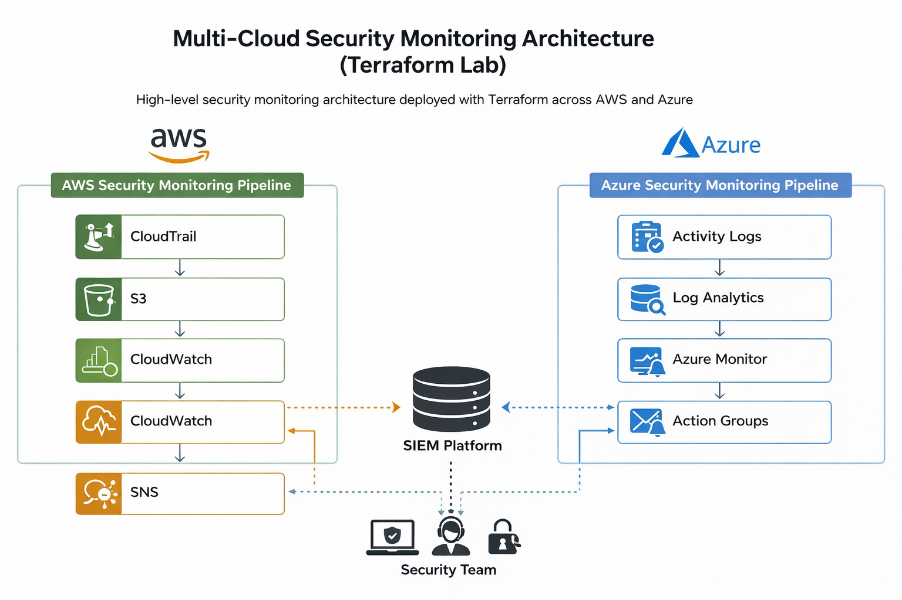
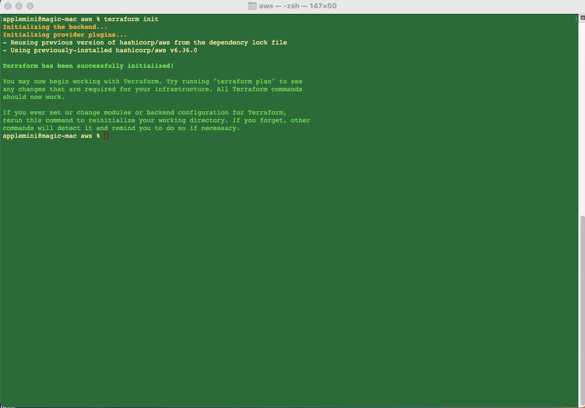
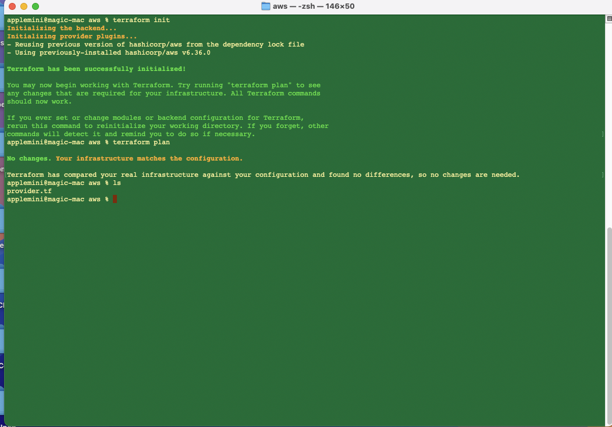
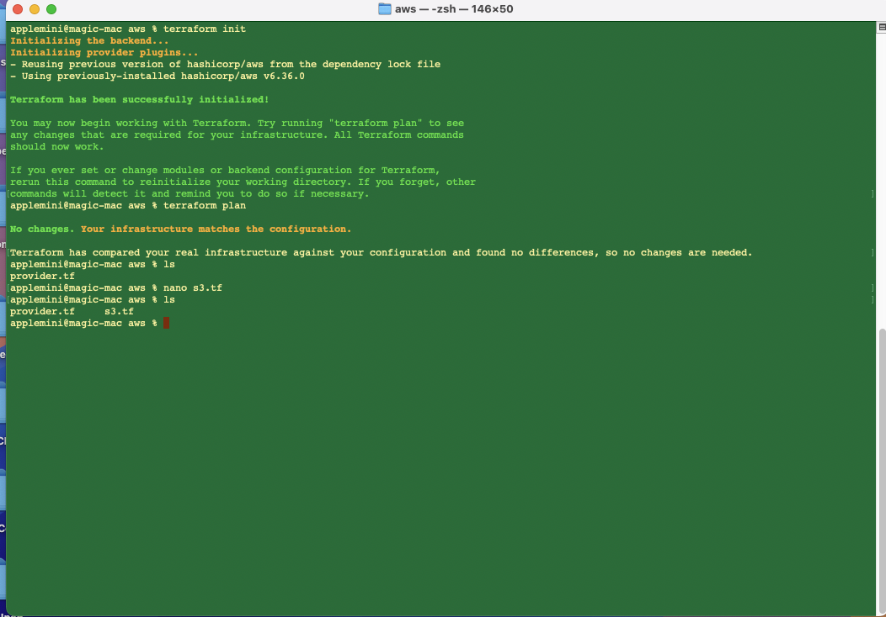
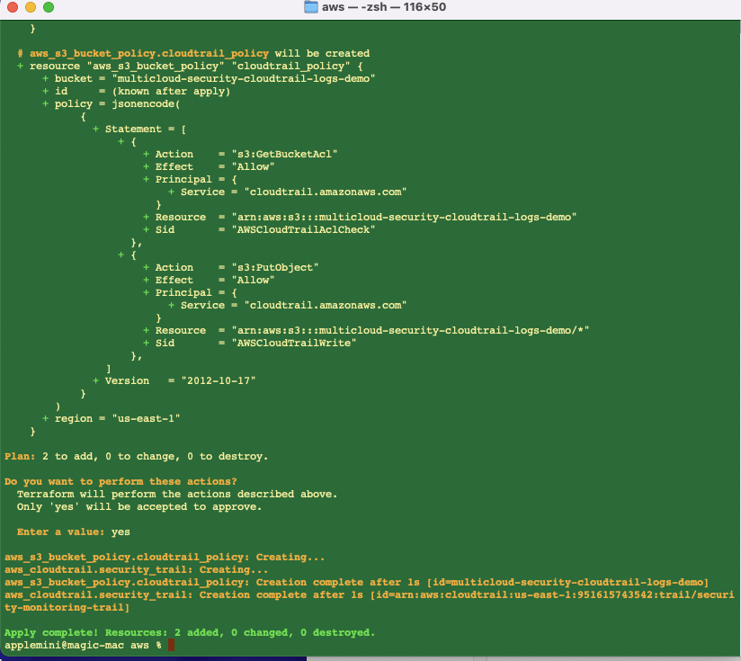
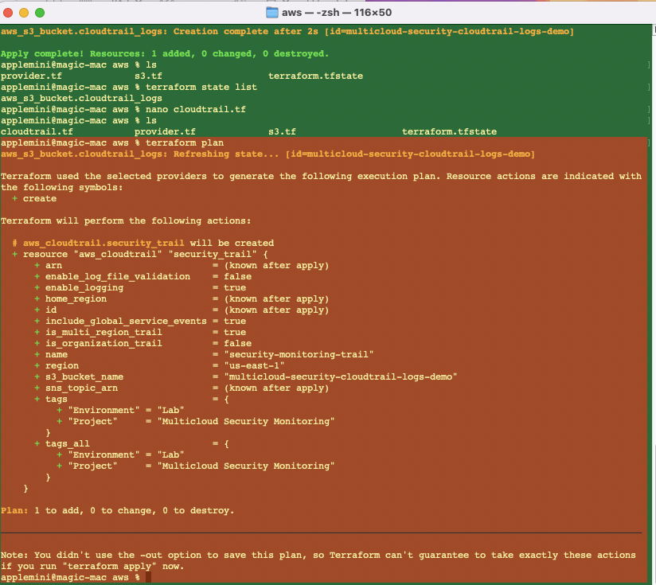
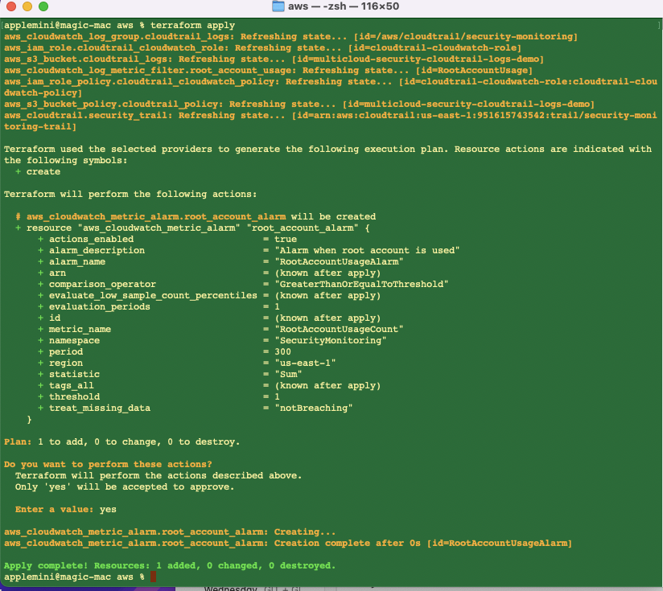
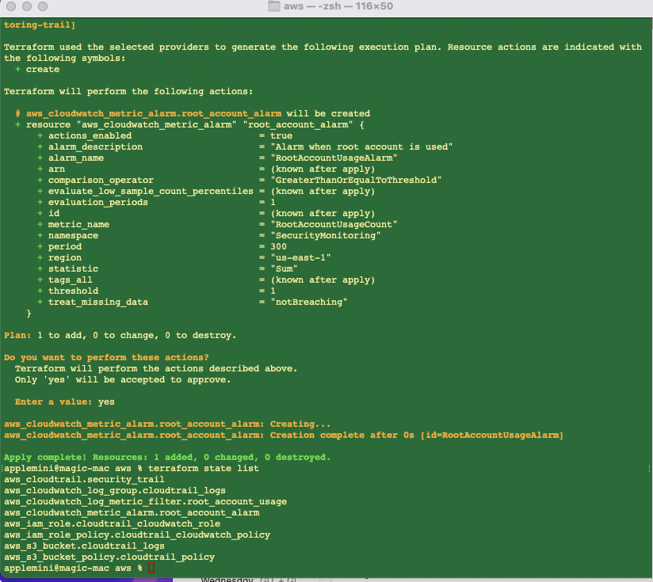
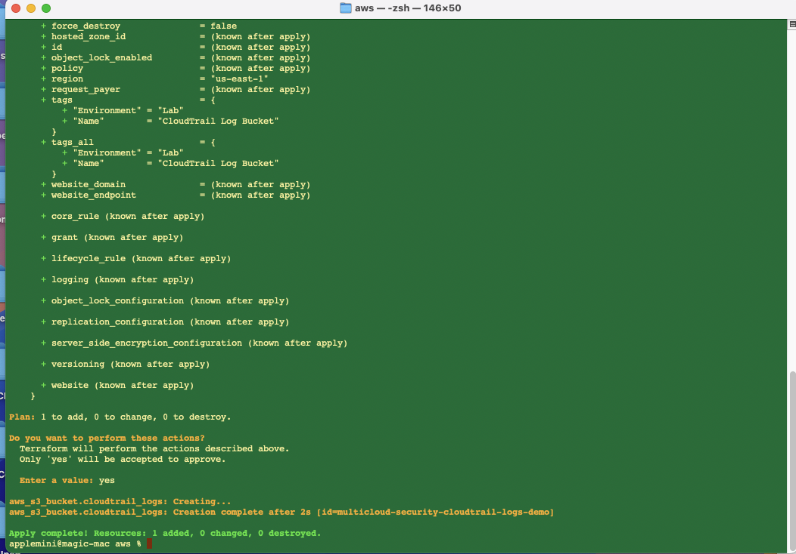

# Terraform Multi-Cloud Security Monitoring

## Overview

## Project Goals

This project demonstrates how to build a **multi-cloud security monitoring architecture** using Terraform.

The objective is to simulate how a security engineering team might deploy centralized monitoring across multiple cloud providers.

Key goals of the project:

- Deploy security telemetry collection in AWS and Azure
- Centralize cloud activity logging
- Detect suspicious activity using log analytics
- Trigger automated security alerts
- Demonstrate Infrastructure as Code using Terraform
- Build a realistic cloud security engineering portfolio project

---

## Repository Structure

```
terraform-multicloud-security-monitoring
│
├── README.md
├── docs
│   └── architecture.png
│
├── screenshots
│
└── terraform
    │
    ├── aws
    │   ├── provider.tf
    │   ├── s3.tf
    │   ├── cloudtrail.tf
    │   ├── cloudwatch.tf
    │   ├── metric_filters.tf
    │   └── alarms.tf
    │
    └── azure
        ├── provider.tf
        ├── activity_logs.tf
        ├── log_analytics.tf
        └── monitor_alerts.tf
```

This structure separates Terraform infrastructure by cloud provider while keeping documentation and screenshots organized.

---

## Multi-Cloud Monitoring Architecture

The project implements centralized monitoring pipelines across AWS and Azure.

### AWS Security Monitoring Pipeline

```
AWS API Activity
      │
      ▼
  CloudTrail
      │
      ▼
  S3 Log Storage
      │
      ▼
  CloudWatch Logs
      │
      ▼
  Metric Filters
      │
      ▼
  CloudWatch Alarms
      │
      ▼
  SNS Security Alerts
```

### Azure Security Monitoring Pipeline

```
Azure Activity Logs
        │
        ▼
Diagnostic Settings
        │
        ▼
Log Analytics Workspace
        │
        ▼
Azure Monitor Alerts
        │
        ▼
Action Groups
```

These pipelines simulate how a **Security Operations team monitors cloud activity and detects potential threats**.
---

## Multi-Cloud Monitoring Architecture

The project implements centralized monitoring pipelines across AWS and Azure.

### AWS Security Monitoring Pipeline

```
AWS API Activity
      │
      ▼
  CloudTrail
      │
      ▼
  S3 Log Storage
      │
      ▼
  CloudWatch Logs
      │
      ▼
  Metric Filters
      │
      ▼
  CloudWatch Alarms
      │
      ▼
  SNS Security Alerts
```

### Azure Security Monitoring Pipeline

```
Azure Activity Logs
        │
        ▼
Diagnostic Settings
        │
        ▼
Log Analytics Workspace
        │
        ▼
Azure Monitor Alerts
        │
        ▼
Action Groups
```

These pipelines simulate how a **Security Operations team monitors cloud activity and detects potential threats**.


## Terraform Project Structure

```
terraform-multicloud-security-monitoring
│
├── README.md
├── .gitignore
│
├── docs
│   └── architecture.png
│
├── screenshots
│
└── terraform
    │
    ├── aws
    │   │
    │   ├── provider.tf
    │   ├── s3.tf
    │   │
    │   └── future
    │       ├── cloudtrail.tf
    │       ├── cloudwatch.tf
    │       └── sns_alerts.tf
    │
    └── azure
        │
        ├── provider.tf
        │
        └── future
            ├── activity_logs.tf
            ├── log_analytics.tf
            └── monitor_alerts.tf
```


This project demonstrates:

- Infrastructure as Code with Terraform
- Multi-cloud security architecture
- Centralized logging
- Security monitoring and alerting
- Threat detection
- Compliance monitoring

This repository is part of a cloud security portfolio designed to demonstrate Terraform and cloud security engineering capabilities.

---

# Architecture

The monitoring architecture is implemented across two cloud platforms.

## AWS Monitoring Architecture

CloudTrail → API activity logs  
S3 → centralized log storage  
CloudWatch Logs → log ingestion  
Metric Filters → detect suspicious activity  
CloudWatch Alarms → security alerts  
SNS → alert notifications  

## Deployment Screenshots

### Architecture Diagram



---

### Terraform Initialization

Terraform initialized successfully and downloaded required providers.



---

### Terraform Plan – Initial State

Initial Terraform plan before resources were created.



---

### Terraform Plan – S3 Bucket Creation

Terraform planning the creation of the S3 bucket used for CloudTrail log storage.



---

### Terraform Apply – CloudTrail Deployment

Successful deployment of AWS CloudTrail logging infrastructure.



---

### Terraform Apply – CloudTrail Creation

CloudTrail trail creation confirmation.



---

### Terraform Apply – CloudWatch Alarm

CloudWatch alarm deployment for root account activity detection.



---

### Terraform State Resources

Final Terraform state confirming all deployed infrastructure.



---

### Terraform Apply Output

Terraform apply execution output showing successful resource creation.




## Terraform Deployment Workflow

The infrastructure in this project was deployed using the standard Terraform workflow.

```
Developer
   │
   ▼
Terraform Configuration (.tf files)
   │
   ▼
terraform init
   │
   ▼
terraform plan
   │
   ▼
terraform apply
   │
   ▼
Cloud Infrastructure Created
   │
   ▼
AWS Security Monitoring Pipeline
CloudTrail → S3 → CloudWatch → Metric Filters → CloudWatch Alarms
```

### Terraform Commands Used

```
terraform init
terraform plan
terraform apply
terraform state list
```

This workflow ensures that infrastructure changes are reviewed before deployment and remain reproducible using Infrastructure as Code.
Additional monitoring components:

GuardDuty → threat detection  
AWS Config → configuration monitoring  
VPC Flow Logs → network monitoring  

---

## Azure Monitoring Architecture

Activity Logs → platform events  
Diagnostic Settings → log forwarding  
Log Analytics Workspace → centralized log storage  
Azure Monitor Alerts → security alerts  
Action Groups → notification routing  

Additional monitoring components:

Defender for Cloud → threat detection  
Azure Policy → compliance monitoring  
NSG Flow Logs → network monitoring  

---

# Repository Structure

terraform-multicloud-security-monitoring

terraform/  
│  
├── aws  
│   └── provider.tf  
│  
└── azure  

README.md

---

# Deployment Plan

This project will be built in phases.

Phase 1 — Core Logging

AWS  
CloudTrail  
S3 Log Bucket  
CloudWatch Logs  

Azure  
Activity Logs  
Log Analytics Workspace  
Diagnostic Settings  

---

Phase 2 — Monitoring and Alerts

AWS  
CloudWatch Metric Filters  
CloudWatch Alarms  
SNS Notifications  

Azure  
Azure Monitor Alerts  
Action Groups  

---

Phase 3 — Threat Detection

AWS  
GuardDuty  

Azure  
Defender for Cloud  

---

Phase 4 — Advanced Monitoring

AWS  
AWS Config  
VPC Flow Logs  

Azure  
Azure Policy  
NSG Flow Logs  

---

# Current Progress

Completed

- Project structure created
- Terraform AWS provider configured
- Git repository initialized
- Code pushed to GitHub

---

# Next Steps

Next session we will begin building the AWS infrastructure.

Steps planned:

1. Initialize Terraform
2. Create the S3 logging bucket
3. Deploy CloudTrail
4. Configure CloudWatch logging

## Architecture Overview

This project implements a **multi-cloud security monitoring architecture** using Terraform across AWS and Azure.

The goal of this lab is to demonstrate how cloud security telemetry can be collected, centralized, and monitored using native cloud logging and alerting services.

---

### AWS Security Monitoring Pipeline

AWS API Activity  
→ CloudTrail  
→ S3 Log Storage  
→ CloudWatch Logs  
→ Metric Filters  
→ CloudWatch Alarms  
→ SNS Alerts

---

### Azure Security Monitoring Pipeline

Azure Activity Logs  
→ Diagnostic Settings  
→ Log Analytics Workspace  
→ Azure Monitor Alerts  
→ Action Groups

---
## Multi-Cloud Monitoring Architecture
```
                Multi-Cloud Security Monitoring 

                ┌───────────────────────────────┐
                │           AWS Cloud           │
                └───────────────────────────────┘

                        AWS API Activity
                               │
                               ▼
                         CloudTrail Logs
                               │
                               ▼
                           S3 Bucket
                       (Central Log Store)
                               │
                               ▼
                         CloudWatch Logs
                               │
                               ▼
                        Metric Filters
                               │
                               ▼
                        CloudWatch Alarms
                               │
                               ▼
                           SNS Alerts
                               │
                               ▼
                        Security Team


                ┌───────────────────────────────┐
                │          Azure Cloud          │
                └───────────────────────────────┘

                        Azure Activity Logs
                               │
                               ▼
                       Diagnostic Settings
                               │
                               ▼
                    Log Analytics Workspace
                               │
                               ▼
                        Azure Monitor Alerts
                               │
                               ▼
                          Action Groups
                               │
                               ▼
                        Security Team
```
---

### Skills Demonstrated

- Cloud Security Architecture  
- Terraform Infrastructure as Code (IaC)  
- AWS Security Monitoring  
- Azure Security Monitoring  
- Detection Engineering
